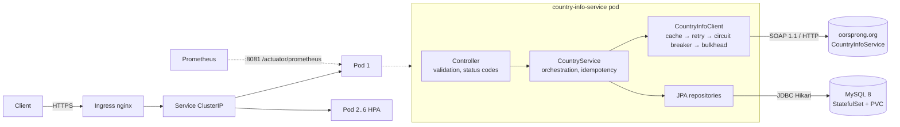

# country-info-service

A Spring Boot 3 / Java 21 microservice that takes a country name over REST, resolves it through the public
[oorsprong.org CountryInfoService](http://webservices.oorsprong.org/websamples.countryinfo/CountryInfoService.wso) SOAP API
(two calls: `CountryISOCode`, then `FullCountryInfo`), stores the result in MySQL, and exposes CRUD endpoints.
It is built to run on Kubernetes and to stay healthy when the third-party SOAP host is slow or down.

Case study: NCBA — Integrations and Microservices Engineer.

| Doc | What's in it |
|---|---|
| [docs/ARCHITECTURE.md](docs/ARCHITECTURE.md) | Components, POST sequence diagram, scaling, failure modes, trade-offs |
| [docs/DEPLOYMENT.md](docs/DEPLOYMENT.md) | minikube / kind / managed cluster deploy, scale, upgrade, rollback |
| [docs/TROUBLESHOOTING.md](docs/TROUBLESHOOTING.md) | Symptom → cause → command → fix runbook |
| [postman/](postman/country-info.postman_collection.json) | Collection covering every endpoint and error case |

## Architecture



Layering (`com.example.countryinfo.*`): `controller` (HTTP only) → `service` (flow, transactions, idempotency) →
`client` (SOAP adapter behind the `CountryInfoClient` interface) and `repository` (Spring Data JPA).
`dto` + `mapper` keep entities off the wire; `exception` holds the domain exceptions and one `@RestControllerAdvice`.
Pods are stateless: any replica can serve any request.

## Create flow

1. `POST /api/v1/countries {"name":"kenya"}` — validated (required, ≤100 chars, letters/spaces/hyphens/apostrophes).
2. Name normalised: trim, collapse spaces, lower-case, capitalise each word → `Kenya`, `South Africa`.
3. **DB first:** if a country with that name is already stored → `409` with its id. No SOAP call, so known countries keep working when the upstream is down.
4. `CountryISOCode(Kenya)` → `KE` (cached 24 h in Caffeine). A result that is not two upper-case letters → `404`.
5. If `KE` is already stored → `409`.
6. `FullCountryInfo(KE)` → mapped to `CountryInfo` + `Language` rows and inserted. A concurrent duplicate that slips past step 5 is stopped by the unique key on `iso_code` and turned into `409`.
7. `201 Created`, `Location: /api/v1/countries/{id}`, body = saved resource.

## Tech choices (short version — reasons in ARCHITECTURE.md)

| Concern | Choice |
|---|---|
| SOAP client | Spring-WS `WebServiceTemplate` + JAXB classes generated at build time from the committed WSDL |
| Resilience | Resilience4j retry (3 attempts, exponential backoff + jitter), circuit breaker (20-call window, 50 %, 30 s open), bulkhead; 3 s connect / 5 s read timeouts |
| Cache | Caffeine for name → ISO code, 24 h TTL, bounded, metrics on |
| Persistence | MySQL 8, Spring Data JPA, Flyway owns the schema (`ddl-auto=validate`), HikariCP |
| Observability | JSON logs with correlation id, Micrometer/Prometheus custom metrics, liveness/readiness groups, OpenAPI |
| Runtime | Multi-stage Docker image, non-root, read-only root FS; Kubernetes Deployment + HPA + PDB + NetworkPolicy |

## Run locally

Prerequisites: JDK 21, Maven 3.9+, Docker.

### Docker Compose (app + MySQL)

```bash
cp .env.example .env          # set the two passwords
docker compose up --build
```

API on `http://localhost:8080`, Swagger UI on `http://localhost:8080/swagger-ui.html`,
actuator on `http://localhost:8081/actuator/health`. Logs are JSON (`dev` profile); use
`SPRING_PROFILES_ACTIVE=local docker compose up` for plain-text logs.

### Maven against a local MySQL

```bash
docker compose up -d mysql
export $(grep -v '^#' .env | xargs)
mvn spring-boot:run           # 'local' profile is the default
```

## Tests

```bash
mvn clean verify              # unit tests (surefire) + Docker-backed integration tests (failsafe)
mvn test                      # unit + @WebMvcTest only, no Docker needed
```

| Test | Type | Covers |
|---|---|---|
| `CountryNameNormalizerTest` | unit | kenya, KENYA, `"  south   africa "`, `cote d'ivoire`, `guinea-bissau`, accents |
| `CountryServiceTest` | unit (Mockito) | happy path, DB-first 409, ISO 409, race → 409, unknown country, upstream failure, bad sort |
| `CountryControllerTest` | `@WebMvcTest` | validation, malformed JSON, 405, 415, every exception → status/body mapping, correlation id |
| `CountryInfoRepositoryIT` | Testcontainers MySQL | Flyway + Hibernate validate, unique key, accent-insensitive lookup, orphan removal, cascade delete |
| `CountryFlowIT` | full app + MySQL + WireMock SOAP | 201 → 409 without SOAP, CRUD round-trip, 404, 500 retried ×3 → 503, timeout → fast 503, SOAP fault → 502, circuit opens and then skips upstream |

## API and curl examples

| Method | Path | Success | Errors |
|---|---|---|---|
| POST | `/api/v1/countries` | 201 + Location | 400, 404, 409, 415, 502, 503 |
| GET | `/api/v1/countries?page=&size=&sort=` | 200 (paged, max size 100) | 400 (unknown sort field) |
| GET | `/api/v1/countries/{id}` | 200 | 400, 404 |
| PUT | `/api/v1/countries/{id}` | 200 | 400, 404, 409 (concurrent edit) |
| DELETE | `/api/v1/countries/{id}` | 204 | 404 |

```bash
B=http://localhost:8080/api/v1/countries

# create
curl -i -X POST $B -H 'Content-Type: application/json' -d '{"name":"kenya"}'
# 201 Created
# Location: http://localhost:8080/api/v1/countries/1
# {"id":1,"isoCode":"KE","name":"Kenya","capitalCity":"Nairobi","phoneCode":"254","continentCode":"AF",
#  "currencyIsoCode":"KES","flagUrl":"http://www.oorsprong.org/WebSamples.CountryInfo/Flags/Kenya.jpg",
#  "languages":[{"isoCode":"en","name":"English"},{"isoCode":"sw","name":"Swahili"}], ...}

# multi-word name
curl -s -X POST $B -H 'Content-Type: application/json' -d '{"name":"  south   africa "}'

# duplicate -> 409, Location points at the existing row
curl -i -X POST $B -H 'Content-Type: application/json' -d '{"name":"KENYA"}'

# unknown -> 404
curl -s -X POST $B -H 'Content-Type: application/json' -d '{"name":"atlantis"}'
# {"timestamp":"...","status":404,"error":"Not Found","code":"COUNTRY_NOT_FOUND",
#  "message":"No country found with name 'Atlantis'","path":"/api/v1/countries","traceId":"6f1c...","details":[]}

# validation -> 400
curl -s -X POST $B -H 'Content-Type: application/json' -d '{"name":"k3nya"}'
curl -s -X POST $B -H 'Content-Type: application/json' -d '{"name":'          # malformed JSON
curl -s -X POST $B -H 'Content-Type: text/plain' -d 'kenya'                     # 415

# list / get
curl -s "$B?page=0&size=10&sort=name,asc"
curl -s "$B?sort=password"                                                       # 400
curl -s $B/1
curl -s $B/999                                                                   # 404

# update (full replacement of editable fields; isoCode is the natural key and not editable)
curl -s -X PUT $B/1 -H 'Content-Type: application/json' -d '{
  "name":"Kenya","capitalCity":"Nairobi","phoneCode":"254","continentCode":"AF",
  "currencyIsoCode":"KES","flagUrl":"http://www.oorsprong.org/WebSamples.CountryInfo/Flags/Kenya.jpg",
  "languages":[{"isoCode":"sw","name":"Swahili"},{"isoCode":"en","name":"English"}]}'

# delete
curl -i -X DELETE $B/1                                                           # 204

# trace one request end to end
curl -s -H 'X-Correlation-Id: demo-123' $B/1
docker compose logs app | grep demo-123
```

Upstream down: with `SOAP_ENDPOINT_URL=http://10.255.255.1/` the create call returns
`503` with `Retry-After: 30` and code `UPSTREAM_UNAVAILABLE` in ~3 × connect-timeout; after enough failures the
code becomes `UPSTREAM_CIRCUIT_OPEN` and the response is immediate. GET/PUT/DELETE keep working throughout.

## Error contract

Every non-2xx response has the same body:
`{ timestamp, status, error, code, message, path, traceId, details[] }`. `traceId` equals the
`X-Correlation-Id` response header and appears on every log line of that request. Stack traces, SQL and upstream
payloads are never returned.

| Status | Codes |
|---|---|
| 400 | `VALIDATION_FAILED`, `MALFORMED_REQUEST`, `INVALID_PARAMETER`, `INVALID_REQUEST` |
| 404 | `COUNTRY_NOT_FOUND` (unknown name), `RESOURCE_NOT_FOUND` (id), `ROUTE_NOT_FOUND` |
| 405 / 415 | `METHOD_NOT_ALLOWED`, `UNSUPPORTED_MEDIA_TYPE` |
| 409 | `COUNTRY_ALREADY_EXISTS` (+ `Location`), `CONCURRENT_MODIFICATION` |
| 502 | `UPSTREAM_INVALID_RESPONSE` (SOAP fault, unparseable or inconsistent payload) |
| 503 | `UPSTREAM_UNAVAILABLE`, `UPSTREAM_CIRCUIT_OPEN`, `UPSTREAM_BUSY` (+ `Retry-After`) |
| 500 | `INTERNAL_ERROR` (generic message; detail only in logs) |

## Configuration

| Env var | Default | Notes |
|---|---|---|
| `SPRING_PROFILES_ACTIVE` | `local` | `local` (plain logs), `dev`, `prod` (JSON logs, Swagger off) |
| `SPRING_DATASOURCE_URL` / `_USERNAME` / `_PASSWORD` | – | Secret in Kubernetes |
| `SOAP_ENDPOINT_URL` | – (local profile defaults to the public endpoint) | |
| `SOAP_CONNECT_TIMEOUT_MS` / `SOAP_READ_TIMEOUT_MS` | 3000 / 5000 | |
| `LOG_LEVEL` | `INFO` (`DEBUG` in local/dev) | level for `com.example.countryinfo` |
| `DB_POOL_MAX_SIZE` | 10 | per pod |

## Assumptions and deviations

- **Name casing.** The brief says "sentence case" (kenya → Kenya). The SOAP lookup matches title-cased names, so
  multi-word names are capitalised per word (`south africa` → `South Africa`), including after hyphens
  (`Guinea-Bissau`). Letters after an apostrophe stay lower case. Lookups in our own DB are case- and
  accent-insensitive (`utf8mb4_0900_ai_ci`).
- **Idempotency.** A second POST for a stored country returns `409 Conflict` with `existingId` in `details` and a
  `Location` header, rather than `200` with the existing body. The unique key on `iso_code` is the source of truth
  under concurrency.
- **Timeouts map to 503, not 504.** For the client an unreachable host, a timeout and an open circuit mean the same
  thing ("retry later"), so they share one status and a `Retry-After` header.
- **PUT** replaces all editable fields and the language list; `isoCode` is immutable (it is the natural key).
- **WSDL.** The committed WSDL is trimmed to the two operations used, with names and types identical to the published
  contract. The build never needs the third-party host.
- **JAXB plugin.** `org.jvnet.jaxb:jaxb-maven-plugin` 4.x is the jakarta-namespace successor of `maven-jaxb2-plugin`.
- **Time limiter.** Not used: Resilience4j's TimeLimiter only applies to async calls. Socket connect/read timeouts
  bound each attempt and are the reliable control for a blocking client.
- **Retry budget.** Worst case per SOAP call is 3 attempts × (3 s + 5 s) + backoff ≈ 25 s; the circuit breaker
  opens after 10 calls at ≥50 % failure, after which failures are immediate.

## Refreshing the WSDL

```bash
curl -s 'http://webservices.oorsprong.org/websamples.countryinfo/CountryInfoService.wso?WSDL' -o /tmp/full.wsdl
# compare the CountryISOCode / FullCountryInfo types with src/main/resources/wsdl/CountryInfoService.wsdl
```
