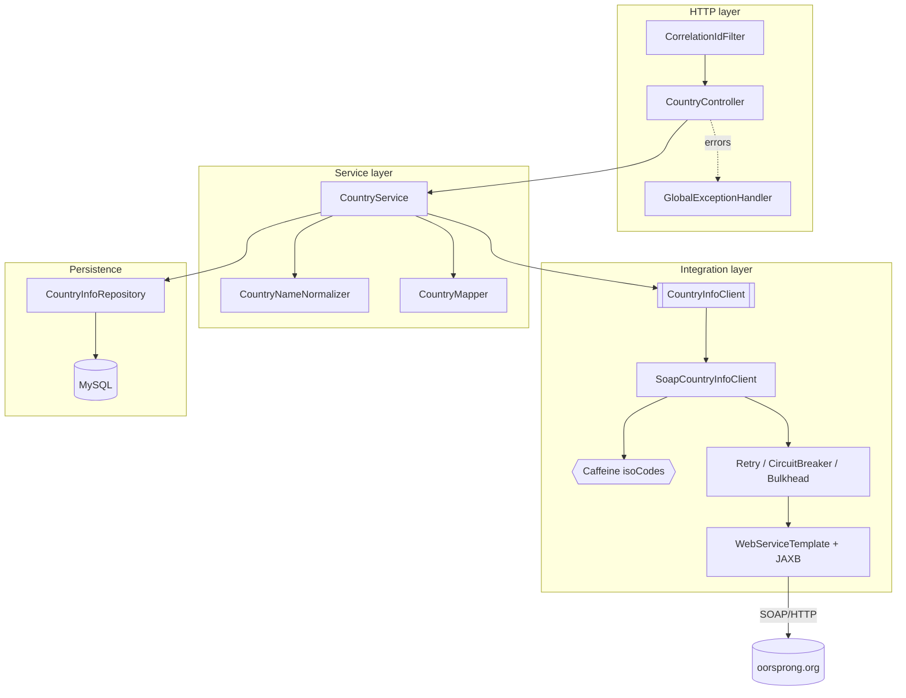
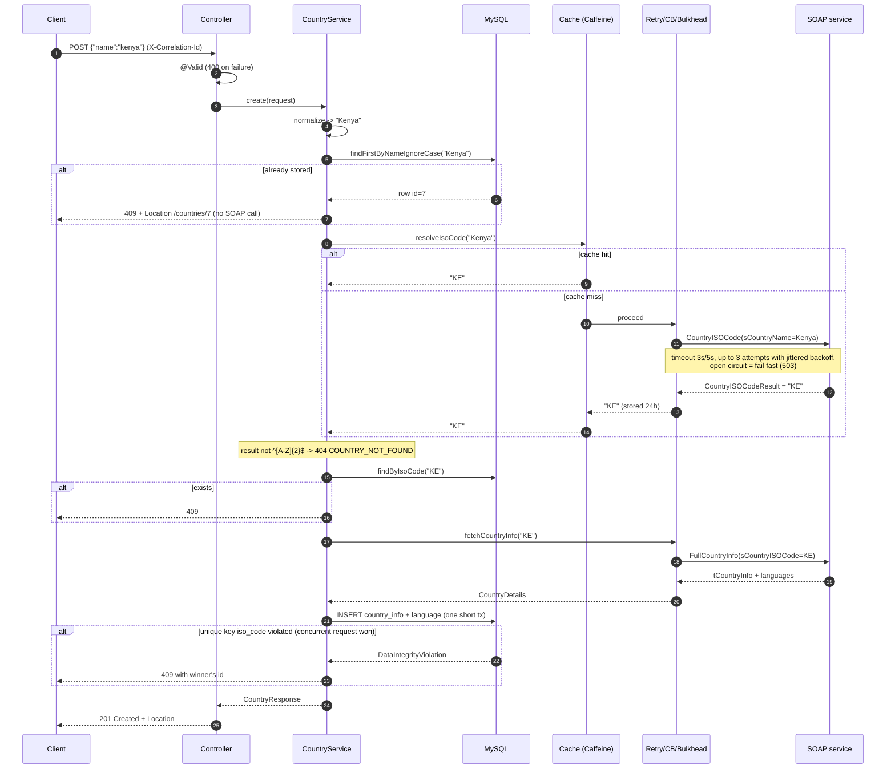

# Architecture

## 1. Components

| Component | Responsibility | Notes |
|---|---|---|
| `CorrelationIdFilter` | Reads/creates `X-Correlation-Id`, puts it in MDC, echoes it | Rejects unsafe values (log injection) |
| `CountryController` | Binding, Bean Validation, status codes, `Location` | No business logic |
| `GlobalExceptionHandler` | Maps every exception to one `ApiError` shape | Adds `Retry-After` on 503, `Location` on 409 |
| `CountryService` | Create flow, idempotency, CRUD, transactions, `countries.created` metric | Not one transaction across SOAP calls (see §5) |
| `CountryNameNormalizer` | Trim, collapse, per-word capitalisation | Pure function, unit tested |
| `CountryInfoClient` (interface) | Port to the upstream provider | Service never sees JAXB types |
| `SoapCountryInfoClient` | Spring-WS adapter, exception translation, per-attempt timing | Cache → Retry → CircuitBreaker → Bulkhead |
| `CountryInfoRepository` | Spring Data JPA | `findByIsoCode`, `findFirstByNameIgnoreCase` |
| Flyway `V1__init.sql` | Schema owner | Hibernate only validates |
| Actuator (port 8081) | Liveness, readiness (incl. DB), Prometheus, circuit-breaker state | Never exposed through the Ingress |

## 2. POST /api/v1/countries — sequence

## 3. Scaling for high load

| Lever | How it is used |
|---|---|
| Stateless pods | No session or in-memory state that matters for correctness; any replica can serve any request. |
| HPA | 2 → 6 replicas at 70 % CPU, fast scale-up (30 s window), slow scale-down (5 min) to avoid flapping. |
| Reads never touch SOAP | GET/PUT/DELETE are DB-only; only POST of a new country calls the upstream. |
| Cache | ISO lookups cached per pod (Caffeine, 24 h). Country codes practically never change. |
| Connection pool | Hikari max 10 per pod → 60 connections at 6 pods, under MySQL `max_connections=200`. Pool connection-timeout is 3 s so a slow DB fails requests fast rather than piling up Tomcat threads. |
| No DB connection held during SOAP calls | The create flow does reads, then remote calls, then one short insert transaction. A slow upstream cannot drain the pool. |
| Bulkhead | At most 20 concurrent SOAP calls per pod; excess fails immediately with 503 instead of tying up the 200 Tomcat threads. |
| Batch fetching | `default_batch_fetch_size=50` loads languages for a whole page in one query (no N+1). |
| Pagination limits | `max-page-size=100`, whitelisted sort fields. |

**Next steps at higher load**

- **Shared cache (Redis).** Caffeine is per pod: with N pods the upstream can see N misses for the same name. Redis
  (behind the same `@Cacheable`, via `spring-boot-starter-data-redis`) gives one shared cache, survives restarts and
  can hold negative results. Not used here because it adds an extra stateful dependency for a cache whose miss cost
  is one SOAP call.
- **Queue-based ingestion (Kafka / RabbitMQ).** Synchronous orchestration is right for this API because the caller
  needs the stored country in the response. A queue becomes the better design for bulk ingestion (thousands of
  names), when the upstream is too slow for an HTTP request budget, or when the upstream rate-limits us: `POST`
  would return `202 Accepted` + a status URL, a worker pool would consume at a controlled rate, and retries would
  move to the broker (with a dead-letter queue).
- **Read replicas / managed DB** with the read-only service methods routed to a replica.

## 4. Failure modes and mitigations

| Failure | Effect without mitigation | Mitigation | What the client sees |
|---|---|---|---|
| SOAP host slow | Threads blocked indefinitely | 3 s connect / 5 s read timeout per attempt | 503 + Retry-After |
| SOAP host down / 5xx | Every create fails slowly | Retry ×3 with exponential backoff + jitter; circuit opens at 50 % of 20 calls, fails fast for 30 s, probes with 3 half-open calls | 503 quickly; reads unaffected |
| SOAP returns fault / garbage | Bad data stored or 500 | Faults and inconsistent payloads → `InvalidUpstreamResponseException`, never retried (same input gives same output) | 502 |
| Unknown country | Treated as success with junk code | Validate `^[A-Z]{2}$`; not-found is ignored by the circuit breaker and never retried | 404 |
| Burst of creates | Upstream overload, thread starvation | Bulkhead (20) + cache | 503 `UPSTREAM_BUSY` for overflow |
| Duplicate / concurrent creates | Duplicate rows | DB-first name check, ISO check, unique key + 409 | 409 |
| Concurrent edits | Lost update | `@Version` optimistic locking | 409 `CONCURRENT_MODIFICATION` |
| DB unavailable | 500s from every pod | Readiness includes DB → pod removed from Service; Hikari 3 s timeout | 503 from ingress (no ready endpoints) |
| Pod crash / OOM | Lost capacity | `ExitOnOutOfMemoryError`, liveness probe, 2+ replicas, PDB | Transparent |
| Rollout | Dropped requests | `maxUnavailable 0`, readiness gate, preStop 5 s, graceful shutdown 20 s | Transparent |
| Node drain | Both replicas evicted | PDB `minAvailable: 1`, topology spread | Transparent |

**Why the circuit breaker is not in readiness.** If an open circuit made pods unready, an upstream outage would take
every replica out of the Service and the whole API, including reads that do not need the upstream, would be down.
The circuit state is still visible at `/actuator/health` and in metrics.

## 5. Trade-offs and decisions

| Decision | Alternative | Why this one |
|---|---|---|
| Synchronous orchestration | Async via queue | The user needs the stored record immediately; one country needs only two fast calls. Queue design kept as the bulk/slow-upstream option (§3). |
| No transaction spanning SOAP calls | `@Transactional` around the whole create | Holding a connection for up to ~25 s per request lets a flaky third party exhaust the pool. Correctness comes from the unique key instead. |
| Unique key on `iso_code` + 409 | Check-then-insert only; or upsert | A pre-check alone races under concurrency. The DB constraint is the only atomic guard across replicas; 409 tells the client exactly what happened and where the existing resource is. Upsert would silently overwrite edits made with PUT. |
| Resilience4j | Hand-rolled retry loops; Spring Retry | Declarative and configured per environment in YAML; retry, breaker and bulkhead compose in a defined order; exports metrics and health out of the box; well-tested edge cases (jitter, half-open). Hand-rolled loops usually miss jitter, breaker state and observability. |
| Caffeine now, Redis later | Redis now | Zero extra infrastructure, sub-microsecond hits; the miss cost is small. Redis becomes worth it when cross-pod duplication or cold starts matter (§3). |
| Cache outermost | Cache inside the breaker | A cached value should be served even when the circuit is open. |
| Timeouts → 503 | 504 | One "retry later" contract for timeouts, connection errors and open circuit. |
| StatefulSet MySQL in-cluster | Managed DB | Self-contained and reproducible on minikube for the exercise. In production, a managed DB (Cloud SQL / RDS) gives backups, PITR, HA failover, patching and monitoring that a single-pod StatefulSet does not. Only the JDBC URL and Secret change. |
| Init container waiting for MySQL | Rely on restarts | Avoids CrashLoopBackOff noise and back-off delays on first deploy; checks TCP only so bad credentials still fail loudly. Startup probe covers Flyway time. |
| Actuator on a separate port | Same port | Ingress cannot expose `/actuator` by accident; NetworkPolicy can restrict it to monitoring. |
| Generated JAXB from committed WSDL | Hand-built XML; runtime WSDL fetch | Type-safe, compile-time breakage on contract change, and builds do not depend on the third-party host. |
| Hand-written mapper | MapStruct | Ten fields; explicit code is easier to review than generated code. |
| No CPU limit, memory limit set | Both limits | CPU limits cause throttling and latency spikes for JVMs; memory limit plus `MaxRAMPercentage=75` keeps heap predictable. |

## 6. Observability

- **Logs:** JSON (`logstash-logback-encoder`) outside the `local` profile, one line per event with `correlationId`,
  `app`, logger, level. Key events: `country.created`, `country.not_found`, `soap.call operation= outcome= latencyMs=`,
  `resilience.retry attempt=`, `resilience.circuit_transition`, `upstream.unavailable`.
- **Metrics (`:8081/actuator/prometheus`):**
  - `soap_client_requests_seconds_{count,sum,bucket}{operation,outcome}` — per-attempt latency and outcome
  - `countries_created_total`
  - `cache_gets_total{cache="isoCodes",result="hit|miss"}` — hit ratio
  - `resilience4j_circuitbreaker_state`, `resilience4j_retry_calls_total`, `resilience4j_bulkhead_available_concurrent_calls`
  - `http_server_requests_seconds_*`, `hikaricp_connections_*`, JVM metrics
- **Useful queries:**
  - Cache hit ratio: `sum(rate(cache_gets_total{cache="isoCodes",result="hit"}[5m])) / sum(rate(cache_gets_total{cache="isoCodes"}[5m]))`
  - SOAP p95: `histogram_quantile(0.95, sum by (le, operation) (rate(soap_client_requests_seconds_bucket[5m])))`
  - SOAP error rate: `sum(rate(soap_client_requests_seconds_count{outcome!~"success|not_found"}[5m]))`
  - Circuit open: `resilience4j_circuitbreaker_state{state="open"} == 1`
- **Suggested alerts:** circuit open > 5 min; 5xx rate > 2 % for 10 min; Hikari pending > 0 for 5 min; pod restarts.
